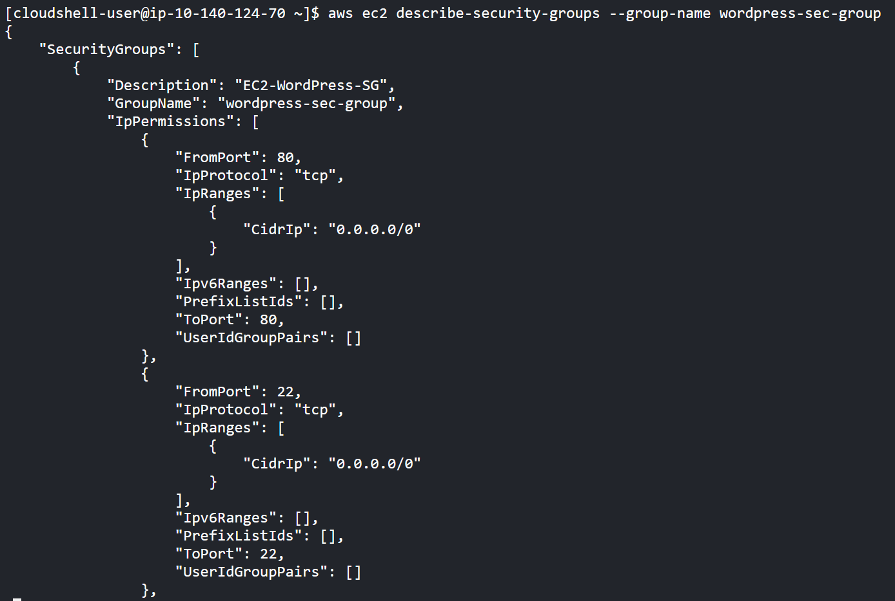
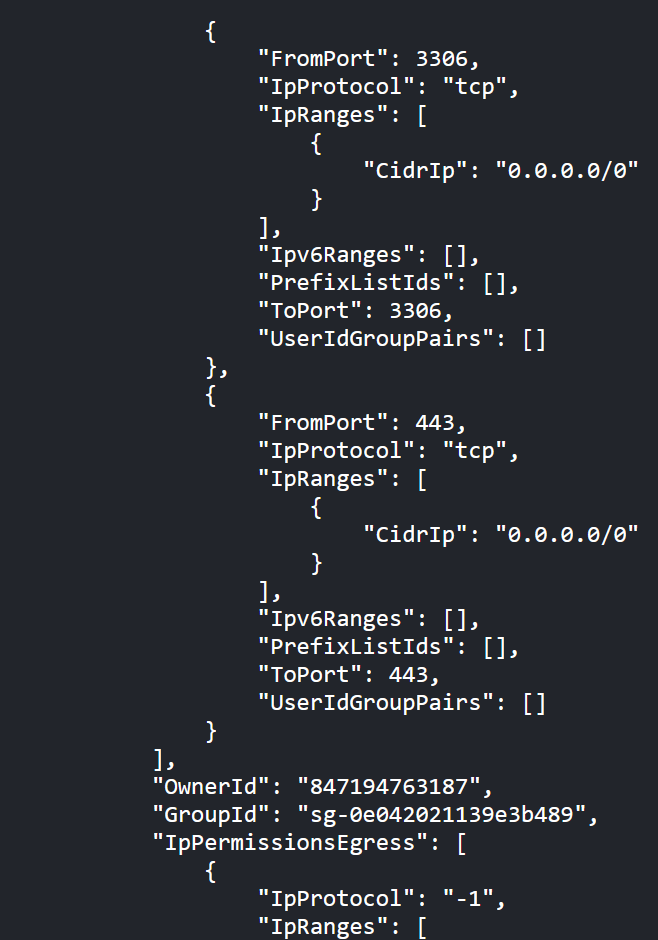
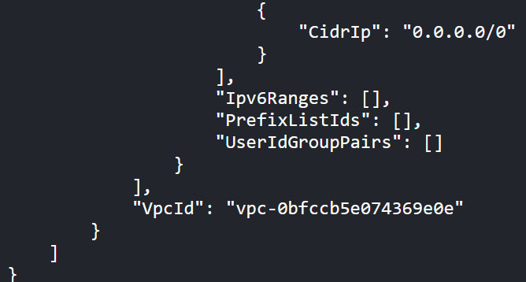
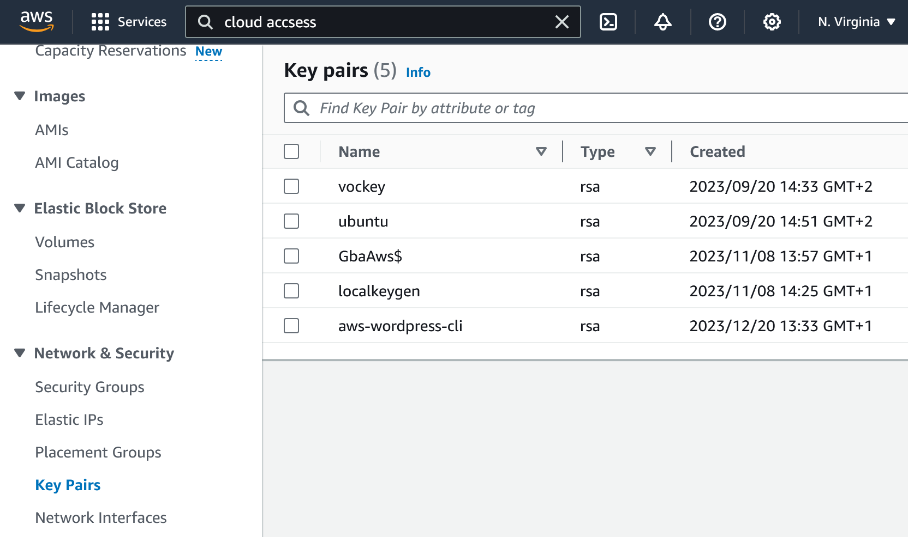
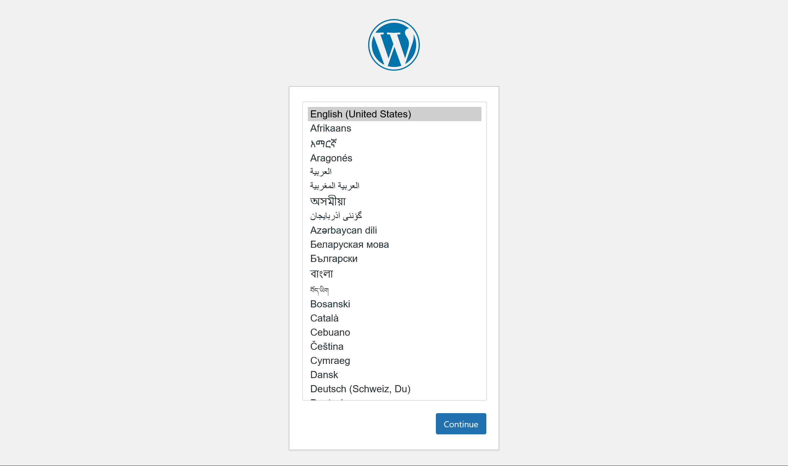
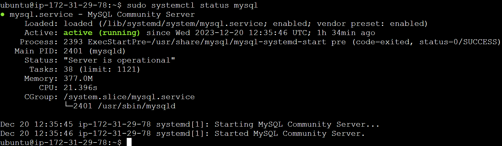
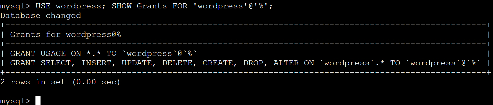

# <center>M364 Einrichten eines CMS</center>
Davatz Ben, Riedener Samuel, Bischofberger Leonie


## 1. Inhaltsverzeichnis
1. [Zweck des Skripts und Git Repository](#1-zweck-des-skripts-und-git-repository)

2. [Planung](#2-planung)

3. [Voraussetzugen](#3-voraussetzugen)
   
4. [Umsetzung](#4-umsetzung) \
   4.1 [Script installWordPress erklärt](#41-script-installwordpress-erklärt) \
   4.2 [Script initialWordPress erklärt](#42-script-initialwordpress-erklärt) \
   4.3 [Script initialMySQL erklärt](#43-script-initialmysql-erklärt) \
   4.4 [Configs](#44-configs) \
	4.4.1 [wp-config](#441-wp-config) \
   	4.4.2 [wordpress](#442-wordpress) \
   	4.4.3 [MySQL_Setup](#443-mysql_setup) \
   	4.4.4 [Configs](#443-configs)
    
5. [Tests](#5-tests) \
   5.1 [Testfall 1](#51-testfall-1) \
   5.2 [Testfall 2](#52-testfall-2)  \
   5.3 [Testfall 3](#53-testfall-3) \
   5.4 [Testfall 4](#54-testfall-4) \
   5.5 [Testfall 5](#55-testfall-5)

6. [Reflexion](#6-Reflexion) \
   6.1 [Bischofberger Leonie](#61-bischofberger-leonie) \
   6.2 [Davatz Ben](#62-davatz-ben) \
   6.3 [Riedener Samuel](#63-riedener-samuel)
    

8. [Quellen](#7-quellen) \
   7.1 [Internetquellen](#71-internetquellen) \
   7.2 [Dokumentquellen](#72-dokumentquellen)
    

## 1. Zweck des Skripts und Git Repository
Wir wurden beauftragt ein Script für das automatische einrichten eines CMS in AWS umzusetzen. Für das CMS nutzen wir WordPress und für AWS EC2. Der komplette Prozess der Erstellung wird mit Github dokumentiert und kommentiert.

## 2. Planung

Damit wir unser Projekt Systematisch umsetzen können haben wir einen groben Zeitplan erstellt. Wir möchten alle Scripts bis am 13.12.2023 fertig haben, damit wir anschliessend noch genügend Zeit für die Dokumentation und alfällige Fehlerbehebungen haben. Anschliessend werden wir unsere Umgebung testen und den Abschluss unserer Dokumentation machen. Wir haben das Script erstellen und das dokumentieren aufgeteilt, weil wir denken dass wir so schneller zum gewünschten Endergebnis kommen.


   | Tätigkeit | Person | Zeitrahmen |
   |----------|----------|----------|
   | Planung | Bischofberger Leonie | 06.12.2023 |
   | Dokumentation erstellen | Davatz Ben | 06.12.2023 |
   | Instancen installieren | Bischofberger Leonie, Riedener Samuel | 06. - 13.12.2023 |
   | WordPress installieren | Bischofberger Leonie, Riedener Samuel | 06. - 13.12.2023 |
   | WordPress konfigurieren | Bischofberger Leonie, Riedener Samuel | 06. - 13.12.2023 |
   | MySQL installieren | Bischofberger Leonie, Riedener Samuel | 06. - 13.12.2023 |
   | MySQL konfigurieren | Bischofberger Leonie, Riedener Samuel | 06. - 13.12.2023 |
   | Tests | Bischofberger Leonie, Riedener Samuel, Davatz Ben | 13. - 17.12.2023 |
   | Dokumentation der Scripts | Davatz Ben | 13. - 17.12.2023 |
   | Dokumentation | Davatz Ben | 13. - 17.12.2023 |
   | Reflexion | Bischofberger Leonie, Riedener Samuel, Davatz Ben | 17. - 19.12.2023 |
   | Abschluss | Bischofberger Leonie, Riedener Samuel, Davatz Ben | 17. - 19.12.2023 |
   
## 3. Voraussetzugen
Das "initialWordPress.sh" Skript muss auf einem Linux Host, welcher mit aws cli installiert und konfiguriert ist, ausgeführt werden. Die Dateien "initialmysql.txt" und "initialWordPress.txt" müssen im gleichen Ordner wie das "initialWordPress.sh" Script sein. Wir empfehlen, dass Script über die "awsclodshell" zu starten.

## 4. Umsetzung

Um Wordpress in AWS zu installieren, haben wir verschiedene Scripts erstellt. Diese werden wir in diesem Kapitel erläutern.


### 4.1 Script installWordPress erklärt
Mit dem "installWordPress.sh" Script werden zwei Instanzen mit den dazugehörigen Schlüsselpaaren und Sicherheitsgruppen erstellt.

`aws ec2 create-key-pair --key-name aws-wordpress-cli --key-type rsa --query 'KeyMaterial' --output text > ~/.ssh/aws-wordpress-cli.pem`

 
Mit diesem Befehl wird ein Schlüsselpaar namens "AWS-wordpress-cli" erstellt. Das Schlüsselpaar verwendet den Typ "rsa". Anschliessend wird der private Schlüssel exportiert und in die Datei: "~/.ssh/aws-wordpress-cli.pem" geschrieben. Als Rückmeldung erhält man den Text "create sec group".


`echo create sec group`

`aws ec2 create-security-group --group-name wordpress-sec-group --description "EC2-WordPress-SG" | cat > secGroup.log`

`aws ec2 authorize-security-group-ingress --group-name wordpress-sec-group --protocol tcp --port 80 --cidr 0.0.0.0/0 | cat >> secGroup.log`

`aws ec2 authorize-security-group-ingress --group-name wordpress-sec-group --protocol tcp --port 443 --cidr 0.0.0.0/0 | cat >> secGroup.log`

`aws ec2 authorize-security-group-ingress --group-name wordpress-sec-group --protocol tcp --port 22 --cidr 0.0.0.0/0 | cat >> secGroup.log`


Mit diesen Befehlen wird eine Sicherheitgruppe namens "wordpress-sec-group" und der Beschreibung "EC2-WordPress-SG" erstellt. Bei der erstellten Sicherheitsgruppen wird der Zugriff über HTTP (Port 80), HTTPS (Port 443), MySQL (Port 3306) und SSH (Port 22) von überall (0.0.0.0/0) freigegeben. Die Ausgaben der Befehle werden der Datei "secGroup.log" angefügt. Die Datei wird bei jedem Start des Script neu erstellt und enthält somit nur die Logs der aktuellen Scriptsitzung. 

`echo start mysql instance`

`aws ec2 run-instances --image-id ami-0fc5d935ebf8bc3bc --count 1 --instance-type t2.micro --key-name aws-wordpress-cli --security-groups wordpress-sec-group --iam-instance-profile Name=LabInstanceProfile --user-data file://initialMySQL.txt --tag-specifications 'ResourceType=instance,Tags=[{Key=Name,Value=MySQL_oie2ds45turo}]' | cat > MySQLInstance.log`

Als Rückmeldung erhält man den Text "start mysql instance". Mit diesen Befehlen wird eine Instanz mit den Namen "MySQL" gestartet. Der Instanz wird, die zu Beginn erstellte Sicherheitgruppe und Schlüsselpaar, mitgegeben. Zusätzlich wir ein Instanzprofil mit dem Namen "LabInstanceProfile" hinzugefügt. Die Ausgaben der Befehle wird in der Datei "MySQLInstance.log" gespeichert.

`cp initialWordPress.txt initialWordPressLive.txt`

`public_ip=$(aws ec2 describe-instances --filters "Name=tag:Name,Values=MySQL_oie2ds45turo" --query` `"Reservations[*].Instances[*].{PublicIP: PublicIpAddress}" --output text | grep -v None)`

`sed -i "s/Soll_DB_Host_IP/$public_ip/" initialWordPresslive.txt`

Die Datei initialWordPress.txt wird kopiert und die Kopie wird umbenannt initialWordPressLive.txt. Die IP-Adresse der erstellten Instanz wird dann abgefragt und in die Variable pubilc_ip geschrieben. Anschliessend wird die Variable in das Dokument "initialWordPressLive.txt" kopiert. 

  `echo start wordpress instance`
  
`aws ec2 run-instances --image-id ami-0fc5d935ebf8bc3bc --count 1 --instance-type t2.micro --key-name aws-wordpress-cli --security-groups wordpress-sec-group --iam-instance-profile Name=LabInstanceProfile --user-data file://initialWordPressLive.txt --tag-specifications 'ResourceType=instance,Tags=[{Key=Name,Value=WordPress}]' | cat > WordPressInstance.log`

`chmod 600 ~/.ssh/aws-wordpress-cli.pem`
 
Als Rückmeldugn der Befehle erhält man den Text "start wordpress instance". Mit den folgenden Befehlen wird eine Instanz mit dem Namen "WordPress" gestartet. Dieser Instanz wird die Security-Group "wordpress-sec-group" und das Schlüsselpaar "aws-wordpress-cli" angefügt. Die Ausgaben der Befehle werden in die Datei "WordPressInstance.log" geschrieben. Schlussendlich wird die Berechtigung des RSA keys so gesetzt, dass nur der Besitzer die Datei "~/.ssh/aws-wordpress-cli.pem" lesen und bearbeiten kann.

`wp_ip=$(aws ec2 describe-instances --filters "Name=tag:Name,Values=WordPress" --query "Reservations[*].Instances[*].{PublicIP: PublicIpAddress}" --output text | grep -v None)`

Mit diesen Befehlen wird die IP-Adresse der "WordPress" Instanz in die Variable "wp_ip" gespeichert.

  `echo wordpress is soon avaiable on $wp_ip`

Schlussendlich erhält man die Rückmeldung "wordpress is soon avaiable on" zusätzlich wird die Ip-Adresse der WordpressInstanz angegeben.


### 4.2 Script initialWordPress erklärt
Mit dem initialWordPress.txt Script wird auf der Instanz WordPress installiert und konfiguriert.

  `sudo apt-get update
  sudo apt-get -y install apache2 ghostscript libapache2-mod-php php php-bcmath php-curl php-imagick php-intl php-json php-mbstring php-mysql php-xml php-zip`

Mit diesem Befehl wird die Liste der neusten verfügbaren Software abgerufen. Anschliessend werden Apache2, Ghostsscript, und PHP installiert.

  `sudo mkdir -p /srv/www`
  
  `sudo chown www-data: /srv/www`

Das Verzeichnis "/srv/www" wird erstellt und dem Webserver Schreibzugriff gewährt.

  `curl https://wordpress.org/latest.tar.gz | sudo -u www-data tar zx -C /srv/www`

Mit diesem Befehl wird die neuste Wordpressversion heruntergeladen und dekomprimiert. 

  `git clone https://github.com/leonie04/Modul-346`
  
  `sudo cp Modul-346/Configs/wordpress.conf /etc/apache2/sites-available/`

Nun wird das Git geklont und `wordpress.conf` in das Verzeichnis des virtuellen Hosts kopieren.

  `sudo a2ensite wordpress`
  
  `sudo a2enmod rewrite`

Anschliessend wird Wordpress in Apache aktiviert und rewrite für die URL-Umleitung aktiviert.

  `sudo a2dissite 000-default`
  
  `sudo service apache2 reload`

Mit diesem Befehl wird die Standartseite in Apache deaktivieren und die Konfigurationen neugeladen.

  `sed -i 's/DB_Host_IP/Soll_DB_Host_IP/' Modul-346/Configs/wp-config.php`

Nun wird die IP-Adresse für die Worpress konfiguration hinterlegt.

  `sudo cp Modul-346/Configs/wp-config.php /srv/www/wordpress/`

Zum Schluss wird die Wordpress-Konfigurationsdatei in den Worpress Installationsorder kopiert.


### 4.3 Script initialMySQL erklärt
Mit dem initialWordPress.txt Script wird eine SQL Datenbank erstellt und konfiguriert.

  `sudo apt-get update`
  
  `sudo apt-get -y install mysql-server` 

Mit diesen Befehlen wird zuerst die Liste der neusten verfügbaren Software abgerufen und anschliessend der `mysql-server` installiert.
                 
  `git clone https://github.com/leonie04/Modul-346`
  
   `sudo mysql -u root < Modul-346/Configs/MySQL_Setup.sql` 

Das Github wird geklont und in das Hauptverzeichnis kopiert. Anschliessen wird die Datei "MySQL_Setup.sql" ausgeführt.

  `sudo service mysql start`

Schlussendlich wird der SQL Server mit dem Namen "mysql" gestartet.

  `sleep 6s`
  `sudo cp Modul-346/Configs/mysqld.cnf /etc/mysql/mysql.conf.d/`

Mit diesen Befehlen wird zuerst 6 Sekunden gewartet und anschliessend das Dokument `mysql.conf` in den Ordner mysql.conf.d kopiert.

 `sudo service mysql restart`

Schlussendlich wird der `mysql-Service` neugestartet.


### 4.4 Configs
Mit den Configs werden MYSQL und Wordpress konfiguriert.

#### 4.4.1 wp-config
Dieses Script wird als konfigurationsgrundlage für die Installation von Worpress verwendet. Dieses Config wird von Worpress bereitgestellt und man kann darin noch seine benötigten eigenen Variablen einfügen.

```define( 'DB_NAME', 'wordpress' );```
```define( 'DB_USER', 'wordpress' );```
```define( 'DB_PASSWORD', 'p!&vvvn?GtgJ0cRs!gHd[7w@Z&@GMG>pETwzV$.1jw(Ej*^w2mt=*St0n$Hy]TW;' );```
```define( 'DB_HOST', 'DB_Host_IP' );```
```define( 'DB_CHARSET', 'utf8' );```
```define( 'DB_COLLATE', '' );```

Mit diesen Befehlen werden die folgednen Elemente definiert: Datenbankname, Datenbankuser, Datenbankpasswort, Datenbankhostnamen und Datenbankcharset 


  ```define('AUTH_KEY',         '4^*;gYe@h>iOHX/Q8YwJ[F{h)Wq@!n%76uWqcjjUrH-+udb2B[OrB*8$(>M}78II');```
  ```define('SECURE_AUTH_KEY',  '5SI@(M+l]}GU|u3*m1;zWV5Cw3y#g<H3T2s%-ydT_|Xt3!1m {k)D&mLU+ G/FOH');```
  ```define('LOGGED_IN_KEY',    'Z%-oXcX2`TDK}xV.DOq]^`41juCRi4tzA}^#+OvllHl4#p|X)/ u-~!K$}O}sVyW');```
  ```define('NONCE_KEY',        '^f}0|qU4+%-%`dA2>%^HWMBUeOVWyR>fQ9Om-b0>kin)mHl7SDLIm7em|aaAc9[Z');```
  ```define('AUTH_SALT',        'jSewMFUv{5q`|/.+1@upg5GAmt;-.~N0wO$${Yp{/)M%_iH_.LGg>v|Mj2&Ii>EQ');```
  ```define('SECURE_AUTH_SALT', '@]1~{mpNVaMm{0p!qA4V8Q!%2RXx:#>J6+u;2psy~4X-:4s;dxrte7j<UUYu.WwL');```
  ```define('LOGGED_IN_SALT',   'iyc+jAF5(X95FkYqg{|6>T7%kQ=;3LD>k!1Gv[HE!>)Cdk%|P>w)E/wg=4G+(<d/');```
  ```define('NONCE_SALT',       'T4fU0<WU(289+6DpqhQT+!=6oTo<f{K;x tOE`0@z#2[jc1~#-RoN::5-(+w?Cr|');```

Mit diesen Befehlen werden einzigartige Schlüssel für die Authentifizierung definiert.


  `$table_prefix = 'wp_';`

Mit diesem Befehl wird der Wordpress Datenbank ein eindeutiger Tabellenpräfix zugewiesen.


  `define( 'WP_DEBUG', false );`

Mit diesem Befehl kann der WordPress-Debugging-Modus aktiviert werden. Aktuell ist dieser aber deaktiviert.


`if ( ! defined( 'ABSPATH' ) ) {
	define( 'ABSPATH', __DIR__ . '/' );
}`

`require_once ABSPATH . 'wp-settings.php';`

Mit diesem Befehl werden eingeschlossene Dateien von WordPress_Vars eingerichtet.

#### 4.4.2 wordpress
Mit diesem Script wird WordPress konfiguriert. Dabei wird ein virtueller Host für den WordPress-Webserver konfiguriert.

  `<VirtualHost *:80>
    DocumentRoot /srv/www/wordpress
    <Directory /srv/www/wordpress>
        Options FollowSymLinks
        AllowOverride Limit Options FileInfo
        DirectoryIndex index.php
        Require all granted
    </Directory>
    <Directory /srv/www/wordpress/wp-content>
        Options FollowSymLinks
        Require all granted
    </Directory>
</VirtualHost>`

Mit diesen Befehlen wird zuerst ein Hauptverzeichnis definiert und anschliessend konfiguriert. Bei der Konfiguration wird das folgen von symbolischen Links aktiviert und das Überschreiben von Konfigurationen in .htacces-Dateien erlaubt. Zusätzlich wird der Standartindex auf "index.php" gesetzt und der Zugriff auf alle Anfragen erlaubt. Anschliessend wird das Verzeichnis "wp-content" konfiguriert. Dabei wird das folgen von symbolischen Links und der Zugriff auf alle Anfragen erlaubt.

#### 4.4.3 MySQL_Setup
Mit diesem Script wird die WordPress Datenbank erstellt und eingerichtet. 

 `CREATE DATABASE wordpress;`

 Mit diesem Befehl wird die Wordpress Datenbank mit dem Namen "wordpress" erstellt.
 
 `CREATE USER 'wordpress'@'%' IDENTIFIED BY 'p!&vvvn?GtgJ0cRs!gHd[7w@Z&@GMG>pETwzV$.1jw(Ej*^w2mt=*St0n$Hy]TW;';`

 Mit diesem Befehl wird der Benutzer "wordpress" erstellt und so konfiguriert, dass er von überall zugreifen kann.
 
 `GRANT SELECT,INSERT,UPDATE,DELETE,CREATE,DROP,ALTER
  ON wordpress.*
  TO 'wordpress'@'%';`

Dem eben erstellten Benutzer "wordpress" werden die Berechtigungen Select, Insert, Update, Delete, Create, Drop und Alter erteilt.
  
 `FLUSH PRIVILEGES;`
 
Mit diesem Befehl werden die Berechtigungen aktualisert und aktiviert.

#### 4.4.4 MySQLd

 `[mysqld]`

Dieser Befehl definiert, dass die folgenden Befehle für den Dienst MySQL gelten.


 `user            = mysql`

Nun wird festgelegt, dass der Server mit dem Benutzer "mysql" gestartet werden soll.

 `bind-address           = 127.0.0.1`
 
 `mysqlx-bind-address     = 127.0.0.1`

Dieser Befehl definiert, dass die MySQL X-Protokollbindung über die IP-Adresse "127.0.0.1" geführt wird. Die Konfigurationsdatei wird gebraucht um die Standarteinstellung auszukommentieren.

 `key_buffer_size         = 16M`

Mit diesem Befehl wird die Schlüsselpuffergrösse auf 16M gelegt. 


 `myisam-recover-options  = BACKUP`

Nun wird festgelegt,dass eine automatische Sicherung durchgeführt wird, wenn ein Fehler auftritt.


 `log_error = /var/log/mysql/error.log`

Mit diesem Befehl wird festgelegt, dass die Fehlermeldungen in der Datei "/var/log/mysql/error.log" abgelegt werden sollen.


 `max_binlog_size   = 100M` 

Dieser Befehl legt die maximale Grösse für Binärprotokoll-Dateien auf 100 Megabyte.


## 5. Tests
Um sicherzustellen das nach dem Ausführen der Scripts Wordpress und die SQL-Datenbank korrekt zur verfügung stehen haben wird folgende Test durchgeführt und nach den Mängelklassen bewertet.
Mängelklasse: 0 = mängelfrei; 1 = belangloser Mangel; 2 = leichter Mangel; 3 = schwerer Mangel; 4 = kritischer Mangel

### 5.1 Testfall 1 
   |ID / Bezeichnung | T-001 Security-Group prüfen |
   |----------|----------|
   | Beschreibung | Nach dem Durchlaufen der Scripts wird geprüft ob die Security-Group richtig erstellt wurde und die richtigen Konfigurationen besitzt |
   | Testvoraussetzung | Script "installWordPress.sh" wurde ausgeführt |
   | Testschritte | Auf dem Linux Host wird der folgende Befehl ausgeführt: *aws ec2 describe-security-groups --group-name wordpress-sec-group* |
   | Erwartetes Ergebnis | Die Security-Group "wordpress-sec-group" wird aufgelistet und zeigt die richtige Konfiguration. |
   
Testdurchführung und Testergebnis
   | Testdatum | 16.12.2023 |
   |----------|----------|
   | Tester | Bischofberger Leonie |
   | Mängelklasse | 0 |
   | Mangelbeschreibung | Der Test wurde erfolgreich durchgeführt |
   | Bemerkungen | Die Security-Group "wordpress-sec-group" wurde aufgelistet und zeigt die richtige Konfiguration. Die Security-Group sollte nun dafür sorgen, dass alle Instanzen die richtigen Zugriffe besitzen, aber nur einer geringen Gefahr durch Zugriff von Böswilligen ausgesetzt sind. |







### 5.2 Testfall 2 
   |ID / Bezeichnung | T-002 Schlüsselpaar prüfen |
   |----------|----------|
   | Beschreibung | Nach dem erfolgreichen Durchlaufen der Installationsscripts wird geprüft, ob ein neues Schlüsselpaar erstellt wurde. |
   | Testvoraussetzung | Script "installWorPress.sh" wurde ausgeführt. |
   | Testschritte | AWS-Konsole starten und zum Bereich Netzwerk & Sicherheit gehen. Dort die Kategorie Schlüsselpaare auswählen. Nun in der Liste prüfen, ob ein Schlüsselpaar namens "aws-wordpress-cli" existiert. |
   | Erwartetes Ergebnis | Das Schlüsselpaar "aws-wordpress-cli" wurde erstellt.  |


Testdurchführung und Testergebnis
   | Testdatum | 16.12.2023 |
   |----------|----------|
   | Tester | Bischofberger Leonie |
   | Mängelklasse | 0 |
   | Mangelbeschreibung | Der Test wurde erfolgreich durchgeführt. |
   | Bemerkungen | Das Schlüsselpaar "aws-wordpress-cli" wurde erstellt und wurde den Instanzen zugeordnet. |



### 5.3 Testfall 3 
   |ID / Bezeichnung | T-003 Wordpress Installation prüfen |
   |----------|----------|
   | Beschreibung | Es wird geprüft ob Wordpress auf der Instance WordPress korrekt installiert wurde. |
   | Testvoraussetzung | Die beiden Scripts "installWordPress.sh" und "initialWorPress.txt" wurden ausgeführt. |
   | Testschritte | Öffentliche Adresse des Wordpress-Instance im Browser suchen. |
   | Erwartetes Ergebnis | Es wird die konfigurierte Startseite der Wordpress-Instanz angezeigt |

Testdurchführung und Testergebnis
   | Testdatum | 16.12.2023 |
   |----------|----------|
   | Tester | Riedener Samuel |
   | Mängelklasse | 0 |
   | Mangelbeschreibung | Der Test wurde erfolgreich durchgeführt. |
   | Bemerkungen | Die Startseite der Wordpress-Instanz konnte im Browser geöffnet werden. Damit steht der Webserver nun zur Verfügung und kann verwendet werden.  |



### 5.4 Testfall 4 
   |ID / Bezeichnung | T-004 Prüfen ob SQL-Datenbank online ist |
   |----------|----------|
   | Beschreibung | Nach der Installation und Konfiguration der SQL-Datenbank wird geprüft, ob diese online ist. |
   | Testvoraussetzung | Die beiden Scripts "installWordPress.sh" und "initialMySQL.txt" wurden ausgeführt. |
   | Testschritte | Die MySQL Instanz starten und folgenden Befehl ausführen: *systemctl status mysql* |
   | Erwartetes Ergebnis | Die SQL-Datenbank ist online. |

Testdurchführung und Testergebnis
   | Testdatum | 16.12.2023 |
   |----------|----------|
   | Tester | Riedener Samuel |
   | Mängelklasse | 1 |
   | Mangelbeschreibung | Die SQL-Datenbank wurde versehentlich vor dem Test gestoppt. Deshalb war der Server während dem Test offline. Nach dem Starten der Datenbank war sie bei einem zweiten Testversuch online und Verfügbar. |
   | Bemerkungen | Die SQL-Datenbank ist online. Die Datenbank wurde somit korrekt aufgesetz und kann verwendet werden. |   




### 5.5 Testfall 5 
   |ID / Bezeichnung | T-005 SQL User Berechtigung prüfen |
   |----------|----------|
   | Beschreibung | Es wird geprüft ob der SQL User "wordpress" über die gewünschten Berechtigungen verfügt. |
   | Testvoraussetzung | Die beiden Scripts "installWordPress.sh" und "initialMySQL.txt" wurden ausgeführt. |
   | Testschritte | Die MySQL Instanz starten und folgenden Befehl ausführen: *USE your_database_name; Shwo Grants FOR 'wordpress'@'%'* |
   | Erwartetes Ergebnis | Der User "Wordpress" besitzt die Berechtigung "SELECT, INSERT, UP-DATE, DELETE, CREATE, DROP und ALTER" |

Testdurchführung und Testergebnis
   | Testdatum | 16.12.2023 |
   |----------|----------|
   | Tester | Davatz Ben |
   | Mängelklasse | 0 |
   | Mangelbeschreibung | Es wurde ausgegeben, dass der User "wordpress" über die gewünschten Berechtigungen verfüggt. |
   | Bemerkungen | Der User Wordpress besitzt die Berechtigung SELECT, INSERT, UP-DATE, DELETE, CREATE, DROP und ALTER  |  



## 6. Reflexion
Im folgenden Kapitel werden wir unser Projekt reflektieren und Verbesserungsvorschläge darlegen.

### 6.1 Bischofberger Leonie
Ich denke wir haben dieses Projekt gut gelöst. Als wir die Aufgabe für dieses Projekt bekammen, wollten wir zuerst das Projekt "Bild verkleinerung" umsetzen. Nach einigen Recherchen mussten wir aber feststellen, dass wir aktuell nicht über einen genug grossen Wissensstand verfügten um diese Projekt umzusetzen. Deshalb haben wir uns schlussendlich für dieses Projekt entschieden. Zu Beginn war ich auch bei diesem Projekt etwas überfordert, doch mti der Hilfe von Samuel Riedener fand ich schnell heraus wie wir dieses Projekt angehen mussten und wo wir uns Informationen beschaffen konnten. Danach hatten wir sehr schnell die erste Version unseres Scripts zur einrichtung des CMS in AWS. Diese Version hat auch sehr gut funktioniert und hat die gewünschten Instancen mit den richtigen konfigurationen erstellt. Leider haben wir uns dann ein bisschen auf unseren Lorbeeren ausgeruht und stellten erst später fest, dass wir unsere SQL-Datenbank auf einer zweiten Instance haben müssen. Daurch kam ich etwas in den Stress, da ich sehr viel Recherche tätigen musste um diese Änderung umzusetzen. Schlussendlich musste ich aber merken, dass diese zusätzliche Änderung grundsätzlich ganz simpel einführbar sit. Dafür dass das Thema AWs für uns alle neu war und wir auch noch nie in einem Projekt GitHub zur Dokumentation verwenden durften, haben wir unsere Projekt sehr gut umgesetz. Als Verbesserungspunkte für ein Weiteres Projekt würde ich neben Github noch ein Kanban System einsetzen, damit die verschiedenen Aufgaben des Projekts klar aufgelistet werden könne. Denn bei diesem Projekt war ich mir nicht immer sicher woran die anderen Teammitglieder arbeiten und somit war es Teils sehr schwer den anderen zu helfen oder den überblick zu behalten welche Aufgabne noch erledigt werden müssen. Mit einem Kanban System wäre diese Problem gelöst und es wäre durch wneige Klicks sichtbar welche Aufgaben noch offen sind und woran die anderen Teammitglieder arbeiten. Ebenfalls würde ich bei einem weiteren Projekt gleich bei Beginn Meetings festlegen an denen alle Teammitglieder teilnehmen und sich austauschen, welche Aufgaben wer übernimmt und wo man noch Hilfe benötigt.

### 6.2 Davatz Ben
Am Anfang konnten wir wählen zwischen den Projekten CMS, Ticketsystem, Bild verkleinern und StockPriceWatchdoc. Das Projekt Bild verkleinern kam uns am spannendsten und am besten umsetzbar vor. Doch wir haben schnell bemerkt, dass unser Wissensstand nicht genügend gross ist um dieses Projekt umzusetzen. Daher haben wir uns für das Projekt CMS entschieden.
Beim Start des Projekts war ich sehr überfordert, da ich einige Lektionen, bei welchen wir das Thema durchgenommen haben, gefehlt habe. Daher war mein Wissensstand ziemlich klein. Aus diesem Grund war mein erster Schritt des Projekts, mich in das Thema hineinzudenken und Aufgaben nachzuholen. Durch Samuel Riedener habe ich auch nochmals vieles dazugelernt. Im Unterricht haben wir immer zusammen gearbeitet. Die Zeit im Unterricht konnten wir gut nutzen und die Zusammenarbeit hat ziemlich gut funktioniert. 
Um Zuhause weiter zu arbeiten haben wir die Aufgaben sehr grob untereinander aufgeteilt. Leider hatten wir unter der Woche ziemlich schlechte Kommunikation. Wir haben uns gegenseitig kein update gegeben und wussten den Stand der Aufgaben erst wieder im Unterricht.
Schade war das ich einmal, als ich an der Doku gearbeitet habe, den Laptop geschlossen habe ohne einen Commit durchzuführen. Somit waren zwei Stunden Arbeit verloren. Dies war das Erste Projekt, bei welchem ich die Dokumentation in einem Markdown Format in GitHub erstellen musste. Alle andere Dokumentationen habe ich mit Word durchgeführt. Darum bin ich mir gewöhnt, dass sich die Datei automatisch speichert.
Bei meinem nächsten Projekt möchte ich einen solchen grossen Fehler vermeiden und auch von zuhause aus besser mit meiner Gruppe kommunizieren. Ansonsten kann ich viel gutes von diesem Projekt mitnehmen.

### 6.3 Riedener Samuel
Das Projekt hat mir sehr gut gefallen. Ich hatte viel Spass am Testen und Überlegen wie ich unsere Probleme lösen muss. Teilweise war es auch etwas zäh. Zuerst wollten wir das Projekt Bild verkleinern machen. Allerdings haben wir da schnell gemerkt, dass wir das dazu notwendige Wissen im Programmieren noch nicht besitzen. Die Installation des CMS WordPress war dann allerdings genau das richtige. Ich konnte meine Erfahrungen mit Linux voll ausnutzen und so das Projekt zum Erfolg führen. Unglücklicherweise wurde ich in der letzten Woche noch krank und konnte nicht so viel Zeit investieren, wie ich wollte. Das Projekt konnten wir trotzdem noch gut abschliessen. In einem weiteren Projekt würde ich schauen, dass ich den Personen, die sich noch nicht so gut auskennen etwas besser aushelfe damit diese Linux besser kennen lernen.

## 7. Quellen
### 7.1 Internetquellen
Für unser Projekt haben wir zur Recherche hauptächlich die offizielle AWs-Webseite genutz. Um sicherzustellen, dass die gefundenen Varianten auch in unserere Umgebung umsetzbar sind.
   |Quellen | Datum |
   |----------|----------|
   | https://www.geeksforgeeks.org/sed-command-in-linux-unix-with-examples/ | 17.12.2023 |
   | https://ubuntu.com/tutorials/install-and-configure-wordpress#1-overview | 09.12.2023 |
   | https://solvedevops.com.au/docs/wordpress/wordpress-on-aws-getting-started/ | 09.12.2023 |
   | https://dev.to/aws-builders/deploy-wordpress-on-ec2-by-wordpress-ami-2mog | 09.12.2023 |
   | https://docs.aws.amazon.com/de_de/managedservices/latest/appguide/ex-create-wp-stack.html | 09.12.2023 |
   | https://aws.amazon.com/de/solutions/retail/content-management-system/ | 09.12.2023 |

### 7.2 Dokumentquellen
Zusätzlich zu den Internetquellen haben wir auch im Berufsschulunterricht immer wieder Dokumente bekommen denen wir ebenfalls Informationen zur Umsetzung unseres Projekts entnehmen konnten.
   |Quellen | Datum |
   |----------|----------|
   | 346-05-AA-Vm-mit-Apache-auf-Cloud.pdf | 17.12.2023 |
   | 06-AA-Cloud-Oekonomie.pdf | 09.12.2023 | 
   | 09-AA-EC2-Instance-CLI.pdf | 09.12.2023 |
   | 346-10-AA-IaC Beispiel.pdf | 09.12.2023 |
   | 09-AA-EC2-Instance-CLI.pdf | 09.12.2023 |


## 3. Formatierungen
   | Spalte 1 | Spalte 2 |
   |----------|----------|
   | Inhalt 1 | Inhalt 2 |
   | Inhalt 3 | Inhalt 4 |
   | grosser Inhalt 1 | grosser Inhalt 2 |


### 1.1 Unterkapitel

  UnterkapitelUnterkapitel Unterkapitel Unterkapitel Unterkapitel Unterkapitel UnterkapitelUnterkapitelUnterkapitelUnterkapitel Unterkapitel \
  UnterkapitelUnterkapitel Unterkapitel  Unterkapitel UnterkapitelUnterkapitel UnterkapitelUnterkapitelUnterkapitelUnterkapitelUnterkapitel


## 3. Reflexion


   


 **Fettschrift** \
 *Kursivschrift*
  
- Aufzählung 1
- Aufzählung 2

1. Schritt 1
2. Schritt 2
    
# Überschriftsebene 1 
## Überschriftsebene 2
### Überschriftsebene 3

> Blockzitate müssen mit einer Leerzeile beginnen und enden

> Jede Zeile des Zitats beginnt mit einer rechten spitzen Klammer und einem Leerzeichen

 `Inlinecode`

 ## 4. Weitere Funktionen

 ### 4.1 Unterkapitel

 > Weitere FunktionenWeitere FunktionenWeitere FunktionenWeitere FunktionenWeitere FunktionenWeitere FunktionenWeitere FunktionenWeitere FunktionenWeitere FunktionenWeitere FunktionenWeitere FunktionenWeitere FunktionenWeitere FunktionenWeitere FunktionenWeitere FunktionenWeitere FunktionenWeitere FunktionenWeitere FunktionenWeitere FunktionenWeitere FunktionenWeitere FunktionenWeitere FunktionenWeitere FunktionenWeitere FunktionenWeitere FunktionenWeitere FunktionenWeitere FunktionenWeitere FunktionenWeitere FunktionenWeitere FunktionenWeitere FunktionenWeitere FunktionenWeitere FunktionenWeitere FunktionenWeitere Funktionen


 
 

	
